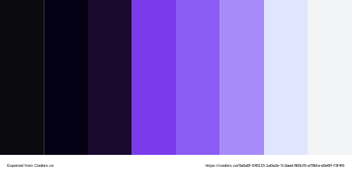

# Gerardo Mecott

   Ingeniero en Sistemas Computacionales 
   Full Stack Developer en formación

---

## Sobre mí

<ul>
  <li> Construyo proyectos funcionales con buen diseño</li>
  <li> Enfocado en desarrollo full stack</li>
  <li> Lidero un grupo de aprendizaje</li>
</ul>

---

## Tecnologías

### Frontend

  
  
  
  
  

### Backend

  
  
  
  

### Herramientas

  
  
  
  
  

---

## Paleta de colores

  

---

## Estadísticas

---

## Contacto

  

  

  

